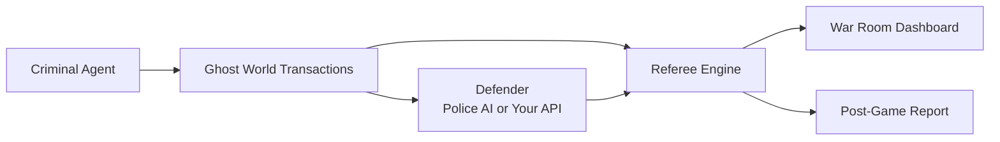
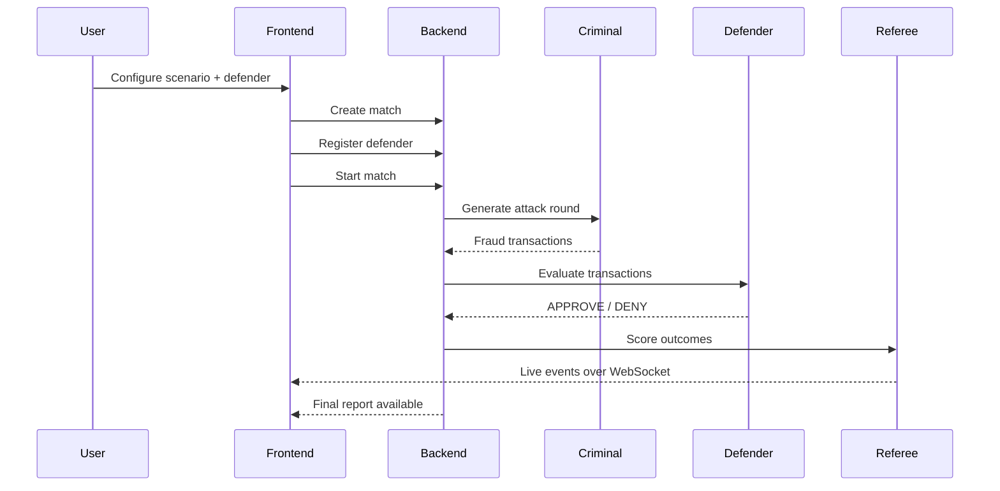
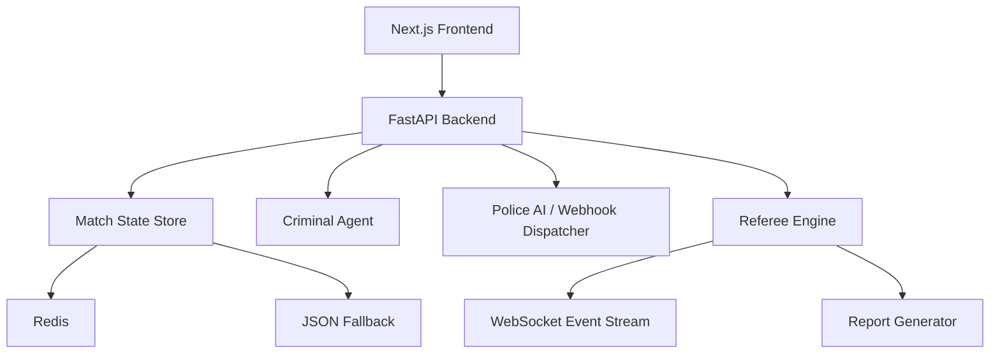

# Ghost Protocol

<p align="center">
  <strong>Adversarial AI Simulation Lab for Fraud Defense</strong>
</p>

<p align="center">
  A synthetic banking sandbox where an AI attacker invents fraud, a defender responds,
  and Ghost Protocol scores every catch, miss, and blind spot in real time.
</p>

<p align="center">
  <a href="#overview">Overview</a> •
  <a href="#why-it-exists">Why It Exists</a> •
  <a href="#architecture">Architecture</a> •
  <a href="#quick-start">Quick Start</a> •
  <a href="#api-surface">API Surface</a> •
  <a href="#demo-flow">Demo Flow</a>
</p>

---

## Overview

Ghost Protocol is not a fraud detector.

It is the environment used to test fraud detectors under pressure.

The product creates a controlled “Ghost World” where:

- a **Criminal Agent** generates or adapts fraud attacks
- a **Defender** is either your own fraud API or the built-in **Police AI**
- a **Referee** compares decisions against hidden ground truth
- a live **War Room** visualizes the match as it unfolds
- a post-game **Report** explains what failed, what held, and what to fix next

This makes Ghost Protocol closer to a flight simulator for fraud teams than a conventional rules engine.

---

## Visual Summary





---

## Why It Exists

Fraud teams have a real testing problem:

- real customer data is sensitive and difficult to use safely
- static sandbox transactions are predictable and easy to overfit to
- many fraud tools are black boxes, so teams cannot rehearse failure modes
- most test harnesses do not simulate an attacker that adapts after getting caught

Ghost Protocol exists to answer a harder question:

**How does a fraud defense system behave when the attacker learns?**

---

## Core Product Loop

1. Create a match.
2. Choose a scenario and criminal persona.
3. Register either Police AI or your own fraud webhook.
4. Start the simulation.
5. Stream all decisions into the live War Room.
6. Let the Criminal Agent adapt between rounds.
7. Generate a report with gaps, missed patterns, and recommendations.

---

## Feature Set

### Live Match Engine

- unique match creation and shareable URLs
- match lifecycle: `setup`, `running`, `paused`, `complete`
- 24-hour archival behavior for older matches

### Criminal Agent

- persona-driven fraud generation
- multi-round attack sequencing
- adaptation behavior between rounds
- Groq-backed runtime with mock fallback when no key is present

### Defender Layer

- built-in Police AI
- custom webhook integration for external fraud APIs
- webhook registration, probing, and error logging
- sample webhook endpoint included for local testing

### Referee Engine

- hidden ground-truth evaluation
- `true_positive`, `false_positive`, `false_negative`, `true_negative`
- financial-loss accounting
- blind spot detection and summary scoring

### War Room UI

- cinematic landing/setup flow
- live transaction feed
- real-time risk meter
- live scoreboard
- world-route transaction map
- replay mode

### Reporting

- report generation per completed match
- JSON export
- PDF export
- recommendations and security-gap summaries

---

## Tech Stack

### Backend

- Python
- FastAPI
- WebSockets
- Pydantic
- HTTPX
- Redis with JSON fallback
- Groq SDK

### Frontend

- Next.js 14 App Router
- React
- Tailwind CSS
- Lucide icons
- React Simple Maps
- D3

### Testing / Tooling

- Pytest
- pytest-asyncio
- Uvicorn

---

## Architecture



### Runtime Model

- **Frontend** drives setup, live monitoring, replay, and reporting.
- **Backend** owns the match lifecycle and canonical state.
- **Criminal Agent** produces attacks.
- **Defender** responds through either Police AI or a user webhook.
- **Referee** scores each transaction against ground truth.
- **WebSocket stream** keeps the War Room live.

---

## Repository Structure

```text
Ghost-Protocol/
├── backend/
│   ├── agents/
│   ├── core/
│   ├── data/
│   ├── routes/
│   ├── tests/
│   ├── config.py
│   └── main.py
├── frontend/
│   ├── app/
│   ├── components/
│   ├── lib/
│   └── package.json
├── .env.example
├── GHOST_PROTOCOL_PRD.md
└── README.md
```

---

## Quick Start

### 1. Clone and prepare the environment

```bash
git clone <your-repo-url>
cd Ghost-Protocol
python3 -m venv .venv
source .venv/bin/activate
```

### 2. Configure environment variables

```bash
cp .env.example .env
```

Minimal useful values:

```env
GROQ_API_KEY=your_groq_key_here
BACKEND_PORT=8000
FRONTEND_URL=http://localhost:3000
SECRET_KEY=change_this_to_a_random_string
```

Notes:

- If `GROQ_API_KEY` is missing, Ghost Protocol automatically falls back to mock AI behavior.
- `REDIS_URL` is optional. If Redis is absent, the app uses local JSON-backed persistence.

### 3. Install backend dependencies

```bash
pip install -r backend/requirements.txt
```

### 4. Install frontend dependencies

```bash
cd frontend
npm install
cd ..
```

### 5. Run the backend

```bash
uvicorn backend.main:app --reload
```

Backend defaults to:

- API: `http://localhost:8000`
- Health: `http://localhost:8000/health`
- WebSocket: `ws://localhost:8000/ws/match/{match_id}`

### 6. Run the frontend

```bash
cd frontend
npm run dev
```

Frontend defaults to:

- App: `http://localhost:3000`

---

## Environment Variables

| Variable | Required | Purpose |
|---|---:|---|
| `GROQ_API_KEY` | No | Enables live Groq-backed AI behavior |
| `GEMINI_API_KEY` | No | Legacy compatibility only |
| `GOOGLE_API_KEY` | No | Legacy compatibility only |
| `REDIS_URL` | No | Optional match-state store |
| `BACKEND_PORT` | No | Backend port, default `8000` |
| `FRONTEND_URL` | No | Allowed frontend origin for CORS |
| `SECRET_KEY` | No | Application secret |

Reference template: [.env.example](/Users/dimural/Ghost-Protocol/.env.example)

---

## Running With and Without AI Keys

### Live AI Mode

Set `GROQ_API_KEY` in `.env`.

This enables Groq-backed behavior for:

- Criminal Agent
- Police AI evaluation
- report generation

### Mock Mode

If `GROQ_API_KEY` is not set, the system still runs end to end using mock logic.

This is useful for:

- UI development
- local smoke tests
- offline demos
- fallback during rate limiting

---

## API Surface

### Match Management

| Method | Path | Purpose |
|---|---|---|
| `POST` | `/api/match/create` | Create a new match |
| `GET` | `/api/match/{match_id}` | Fetch match state |
| `POST` | `/api/match/{match_id}/start` | Start a match |
| `POST` | `/api/match/{match_id}/pause` | Pause a match |
| `POST` | `/api/match/{match_id}/reset` | Reset a match |

### Defender

| Method | Path | Purpose |
|---|---|---|
| `POST` | `/api/register-defender` | Register defender |
| `POST` | `/api/defender/register` | Alias for defender registration |
| `POST` | `/api/defender/test` | Probe a custom webhook |
| `GET` | `/api/defender/{match_id}/errors` | Retrieve webhook dispatch errors |
| `POST` | `/api/defender/sample-webhook` | Built-in sample defender endpoint |

### Reports

| Method | Path | Purpose |
|---|---|---|
| `GET` | `/api/report/{match_id}` | Fetch report |
| `GET` | `/api/report/{match_id}/export?format=json` | Export JSON report |
| `GET` | `/api/report/{match_id}/export?format=pdf` | Export PDF report |

### WebSocket

| Protocol | Path | Purpose |
|---|---|---|
| `WS` | `/ws/match/{match_id}` | Stream live match events |

### Utility

| Method | Path | Purpose |
|---|---|---|
| `GET` | `/` | Root status payload |
| `GET` | `/health` | Health check |

---

## Example API Usage

### Create a match

```bash
curl -X POST http://localhost:8000/api/match/create \
  -H "Content-Type: application/json" \
  -d '{
    "scenario_name": "Groq Test",
    "criminal_persona": "patient",
    "total_rounds": 2
  }'
```

### Register Police AI

```bash
curl -X POST http://localhost:8000/api/defender/register \
  -H "Content-Type: application/json" \
  -d '{
    "match_id": "your_match_id",
    "use_police_ai": true
  }'
```

### Register your own API

```bash
curl -X POST http://localhost:8000/api/defender/register \
  -H "Content-Type: application/json" \
  -d '{
    "match_id": "your_match_id",
    "webhook_url": "http://127.0.0.1:8000/api/defender/sample-webhook",
    "use_police_ai": false
  }'
```

### Start the match

```bash
curl -X POST http://localhost:8000/api/match/your_match_id/start
```

### Connect to the WebSocket

```bash
wscat -c ws://localhost:8000/ws/match/your_match_id
```

---

## Frontend Routes

| Route | Purpose |
|---|---|
| `/` | Landing page + setup flow |
| `/match/[matchId]` | Live War Room |
| `/replay/[matchId]` | Step-by-step replay |
| `/report/[matchId]` | Post-game report |
| `/scenarios` | Scenario library / clone flow |

---

## Demo Flow

If you are showing Ghost Protocol live, this sequence works well:

1. Open the landing page.
2. Choose a scenario and a defender path.
3. Launch the match.
4. Open the War Room.
5. Watch the transaction feed and risk meter react.
6. Show the attacker adapting between rounds.
7. Open the replay.
8. Open the final report.

Recommended highlight:

- show the defender catching obvious fraud early
- show the attacker adapting in round two
- end on the report and recommendations

---

## Testing

### Backend tests

```bash
pytest
```

### Frontend lint

```bash
cd frontend
npm run lint
```

### Frontend production build

```bash
cd frontend
npm run build
```

---

## Notes for Custom Defender APIs

Ghost Protocol supports a custom webhook defender path.

Your endpoint should:

- accept transaction JSON
- return a decision payload
- respond quickly enough for live simulation

For local testing, the built-in sample endpoint works out of the box:

```text
http://127.0.0.1:8000/api/defender/sample-webhook
```

---

## Project Status

This repository already includes:

- the live simulation loop
- Groq integration
- batch Police AI evaluation
- replay mode
- reporting
- scenario cloning
- shareable match URLs

The detailed implementation plan and session history live in:

- [GHOST_PROTOCOL_PRD.md](/Users/dimural/Ghost-Protocol/GHOST_PROTOCOL_PRD.md)

---

## Design Principles

Ghost Protocol is built around a few product ideas:

- make AI behavior visible, not hidden
- test adaptation, not just detection
- keep the sandbox safe and synthetic
- turn fraud evaluation into something explorable in real time

---

## Screens at a Glance

```text
Landing        → configure scenario, defender, launch
War Room       → live transaction feed, risk, score, map
Replay         → step through the match transaction by transaction
Report         → analyze failures and export findings
Scenario Library → revisit, clone, and rerun prior matches
```

---

## License

No license file is currently included in this repository.

If you plan to publish or open-source the project, add a license before making the repository public.
